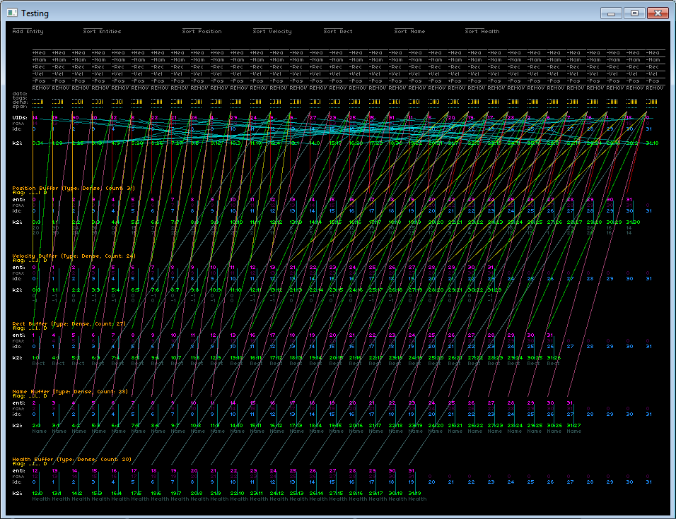

# minECS

A minimal, [blazing-fast](https://github.com/Alan-FGR/minECS/issues/1) Entity-Component System written in modern C#.

This is a *real* ECS, it's data-oriented and CPU cache friendly.

If you're looking for a C++ library, I highly recommend the excellent [EnTT](https://github.com/skypjack/entt).

Now ships with a FNA-powered visual testing application:

Unsorted buffers:

Sorted buffers:

